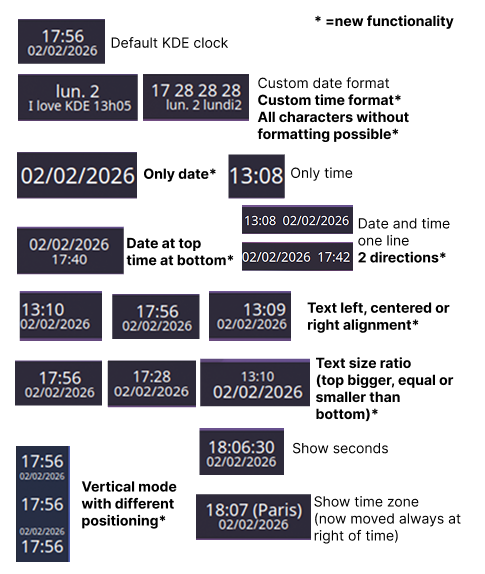
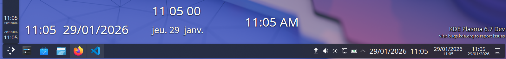

# Digital Clock +

### A KDE Plasma's fork of Digital Clock with more personnalisation options. 
Link of original project: https://invent.kde.org/plasma/plasma-workspace at ./applets/digital-clock

> [!NOTE]
> Works only on KDE Plasma 6.0 or +

## Functionalities in more

* To show only the date
* To change position of date and time (with more options)
* To customize the time format
* To change the ratio size at time and time (only horizontal mode)
* To change text aligment (left, right or centered) (only horizontal mode)
* To put all characters without transformation on custom date and time format


An illustration: 



A screenshot: 



## Build and installation

Requirements: to configure KDE software on your computer: https://develop.kde.org/docs/getting-started/

Clone the project: `git clone https://github.com/valmenu59/DigitalClockPlus`

Full command: 
```
mkdir build 
cd build 
cmake .. -DCMAKE_INSTALL_PREFIX=/usr
cmake --build .
sudo cmake --install .
plasmoidviewer -a com.clock.plus
```

One line command on ./build:
``` 
cmake --build . && sudo cmake --install . && plasmoidviewer -a com.clock.plus
```

To test directly on the desktop, it is possible to see Digital Clock + in widgets on KDE one time installed

If you want reactualize the widget directly on desktop:
```
plasmashell --replace
```